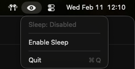
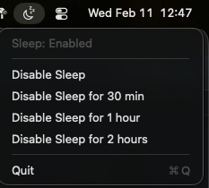
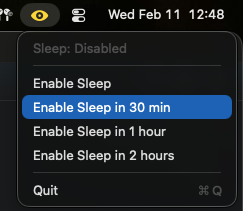

# Sleepless

A macOS menu bar app that shows whether your Mac can sleep. Watches the pmset plist for changes and displays a moon icon (sleep enabled) or a yellow eye icon (sleep disabled). Click to toggle, or set a timer to auto-re-enable sleep.



| Sleep enabled | Sleep disabled |
|---|---|
|  |  |

## Features

- Toggle sleep on/off from the menu bar
- Timed disable — "Disable Sleep for 30 min / 1 hour / 2 hours" with auto-re-enable
- Timed re-enable — "Enable Sleep in 30 min / 1 hour / 2 hours" when already disabled
- Live countdown in the menu while a timer is running
- Uses `pmset disablesleep` — prevents sleep even when the lid is closed
- Instant detection of external changes via file system watcher (no polling)
- Re-enables sleep on quit

## Setup

Requires `just`, Swift 5.9+, and Xcode command line tools.

```sh
just build           # compile the app bundle
just test            # run unit tests
just run             # build and launch
just install         # build, setup sudoers, copy to /Applications
just clean           # remove build artifacts
```

### Sudoers

Sleepless uses `sudo pmset disablesleep` to toggle sleep (required for lid-close prevention). The `just install` command will automatically set up a scoped sudoers rule in `/etc/sudoers.d/sleepless` that allows this without a password prompt. You'll be asked to confirm before it's installed.
